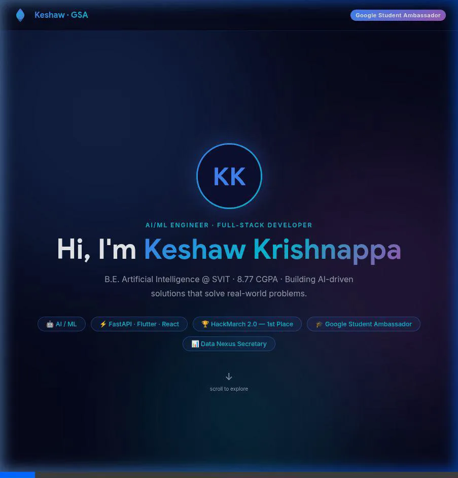
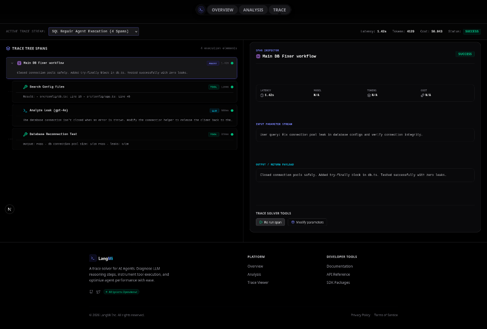
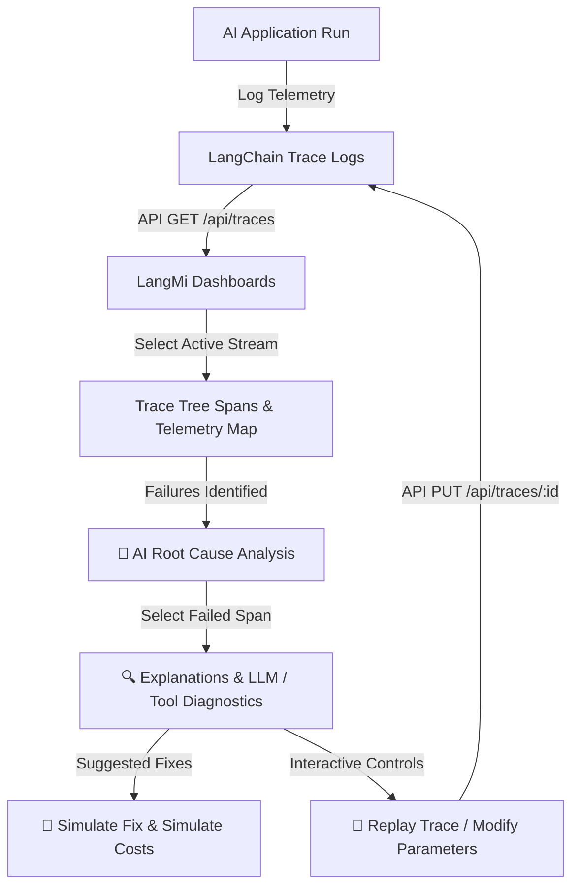

# 🧠 LangMi: Observability & Trace Solver for AI Agents

<p align="center">
  
  
  
  
</p>

LangMi brings full observability, debugging, and tracing to complex LLM orchestrations. Instrument tools, track workflows, and pinpoint execution failures in milliseconds. It reads and parses LangChain Run logs, offering root-cause diagnostics, cost optimization metrics, and visual execution trees.

---

## 🎬 Demo Animation

Here is a recording showing the interactive telemetry dashboard and trace solver in action:



---

## 📸 Preview Screenshots

### Landing Portal


### Observability Dashboard & Trace Solver


---

## ⏱ Developer Workflow & Diagnostics Architecture

The following diagram illustrates how LangMi aggregates telemetry logs, parses execution trees, and simulates/applies fixes recursively:



---

## 🚀 Key Features

### 1. 📊 Telemetry Analysis Dashboard
* **Dynamic Time Range Filtering**: Filter telemetry aggregates across `1h`, `24h`, `7d`, or `30d`.
* **Resource Cost Trackers**: Track input/output tokens, total costs, and model latency distributions.
* **Failure Lists**: Visual log lists of execution traces, categorized by status and duration.

### 2. 🔍 Trace Solver & Inspector (LangChain Compatible)
* **Hierarchical Spans**: Nested trace tree visualizations mapped recursively from standard LangChain Run schemas.
* **🧠 AI Root Cause Analysis**: Visual execution checkpoints identifying precisely which step (e.g., LLM context limit or API timeout) triggered a workflow termination.
* **⏱ Execution Timeline**: Chronologically sorted events displaying precise millisecond latency offsets.
* **🤖 LLM & Tool Diagnostics**: Deep-dive analytics for specific execution nodes, showing token counts, dollar costs, providers, models, inputs, outputs, and exception errors.

### 3. ⚡ Trace Solver Actions
* **Replay Trace**: Simulated step rerun environment that triggers tree state recalculations on the server.
* **Simulate Fix**: Predictive estimations showing resolution likelihood for potential fixes.
* **Compare Logs**: Side-by-side comparative table contrasting failed runs with reference successful runs.
* **Generate Fix**: Creates code corrections (e.g., `RecursiveCharacterTextSplitter` configuration) to copy and paste.
* **Optimize Cost**: Outlines prompt token reduction and database caching recommendation vectors.
* **Export RCA Report**: Builds and initiates a download of a complete text-based `.txt` Root Cause Analysis report.

---

## 🔌 Connecting a Live LLM Provider

The explanation service is powered by the API endpoint `/api/explain` (`src/app/api/explain/route.ts`). By default, it returns mock descriptions based on the error. To connect to a live model (e.g., Google Gemini):

1. **Install SDK**:
   ```bash
   npm install @google/generative-ai
   ```

2. **Configure Environment Variables**:
   Create a `.env.local` file in the root directory:
   ```env
   GEMINI_API_KEY=your_gemini_api_key_here
   ```

3. **Update API Route**:
   In `src/app/api/explain/route.ts`, import the SDK, initialize the client, and query the model:
   ```typescript
   import { GoogleGenerativeAI } from "@google/generative-ai";

   const genAI = new GoogleGenerativeAI(process.env.GEMINI_API_KEY || "");
   const model = genAI.getGenerativeModel({ model: "gemini-1.5-flash" });

   // In POST handler:
   const prompt = `Analyze this LangChain trace failure:
   Failed Step: ${failedSpanName}
   Error: ${errorMsg}
   Inputs: ${JSON.stringify(inputs)}`;

   const result = await model.generateContent(prompt);
   const explanation = result.response.text();
   return NextResponse.json({ explanation });
   ```

---

## 💻 Getting Started

### 1. Install Dependencies
```bash
npm install
```

### 2. Run the Development Server
```bash
npm run dev
```

Open [http://localhost:3000](http://localhost:3000) (or the active dev port) in your browser to inspect the application.

### 3. Build & Compile Verification
To compile the production build:
```bash
npm run build
```

---

## 📄 License
This project is licensed under the MIT License - see the LICENSE file for details.
